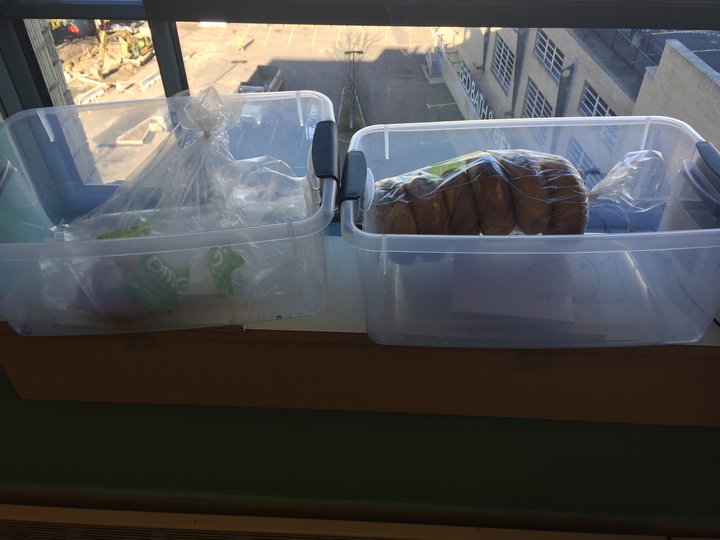
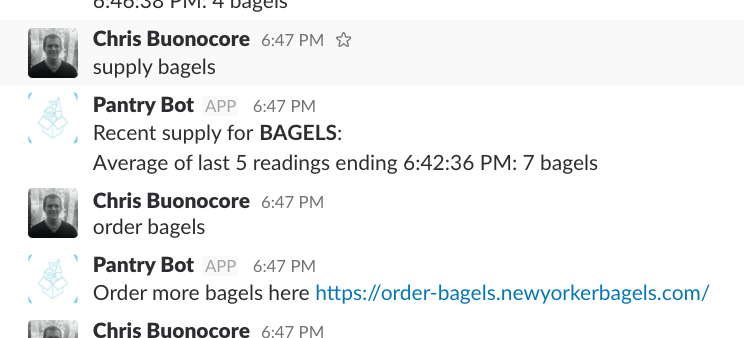

Pantry  Slack Bot
---

Slack Bot for retrieving real time snack supplies from your office kitchen or pantry using real time AWS data streams (Kinesis).

Official submission for the <a href="https://awsiot.devpost.com/?ref_content=featured&ref_feature=challenge&ref_medium=discover">AWS IOT Kinesis Challenge</a>.

Code Included:<br/>
* Slack App (stream consumer)
* Raspberry Pi MQTT App (stream producer)

### Concept

Bagels are the most frequently consumed product in our office. We set out to build a solution that would let you know how many bagels were in the office from your mobile or desktop in real time, from anywhere. 

No longer do our staff members live in wonder coming into the office over whether there will be bagels or not. Now they can slack a quick message to the office pantry bot and see if they need to make a pitstop at the local Starbucks on their morning commute.

Though we demoed this with bagels, this could be used to remotely monitor other supplies as well.

<h4>Front of Scale Setup</h4>


### Technologies used.

* Nodejs/Express web server
* Slack sdk
* AWS-KCL (kinesis consumer sdk)
* Mosquito (Raspberry Pi MQTT broker)

We have the Raspberry Pi setup to sample from the tared (neutraled out with bin weight) stands as quickly as you can get data from the load cells. We take the average of these incoming measurements over 30 seconds and broker them to the AWS Kinesis backend.

On the slack side, we have a remote web server set up as a Kinesis data consumer, which collects and stores the incoming measurements from the data stream. These measurements are then stored locally on the server and made available to end users in the office by communicating with the slack bot.

### Equipment

<ol>
    <li>5 kg load cells (compatible with Raspberry Pi)</li>
    <li>Screws, bearings, and plywood square cutouts for the stands</li>
    <li>Raspberry Pi Zero W (or equivalent)</li>
    <li>Plastic bins for each stand in the setup</li>
    <li>Wires and cabling</h4>
</ol>


### Other Images

<h4>Dual measurement bin setup</h4>

<h4>Slack bot live conversation</h4>


### Dev Notes:
Running the slack server:
```
yarn
yarn start
```

Running the container from your local Dockerfile (using port 5000 as the default).
```
sudo docker build -t pantry-bot .
sudo docker run -p 5000:5000 pantry-bot
```

### Useful links:
* https://api.slack.com/tutorials/watson-sentiment
* https://github.com/evansolomon/nodejs-kinesis-client-library